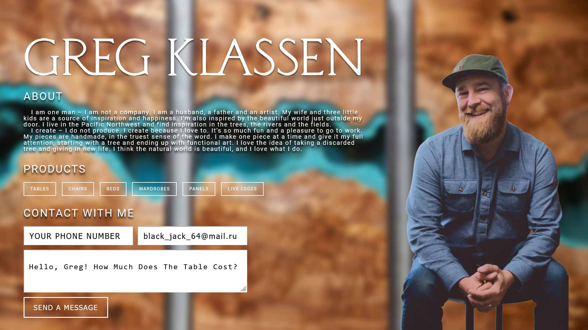
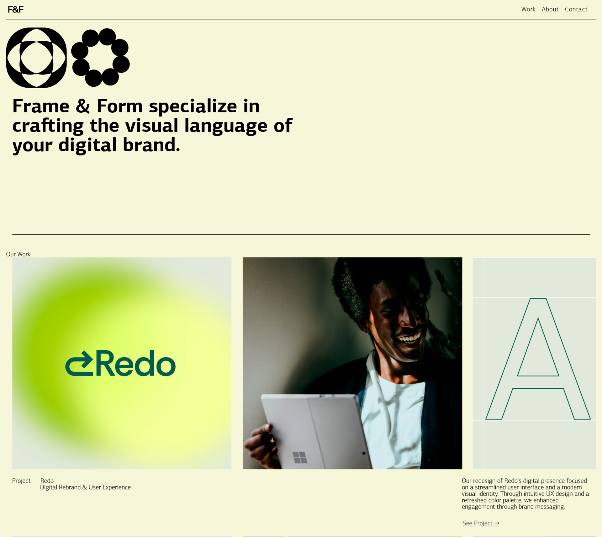
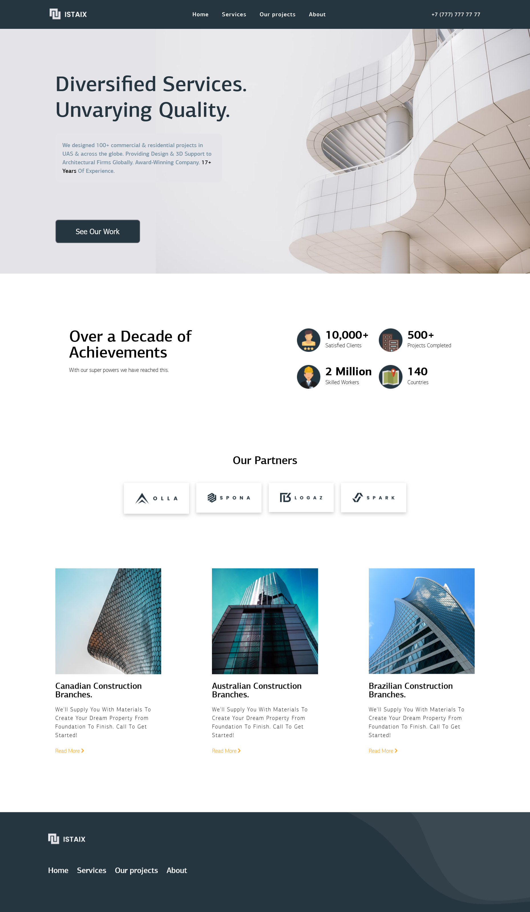
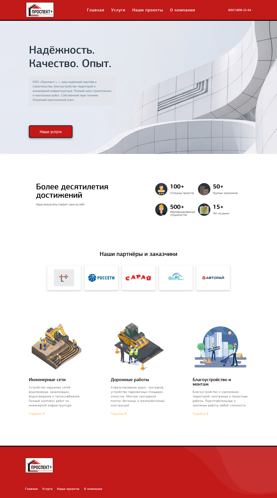

## Я верстальщик

Делаю адаптивные лендинги, сайты-визитки и многостраничники по макетам Figma.  
HTML5, CSS3, SCSS, JavaScript, БЭМ — мой основной стек.

### Мои работы (4 проекта):
<table>
  <tr>
    <td></td>
    <td><strong>🎨 Лендинг дизайнера Greg Classen</strong> 🔗 <a href="https://vrust00.github.io/Greg-Classen-Design/">Посмотреть сайт</a></td>
  </tr>
  <tr>
    <td></td>
    <td><strong>🏢 Студия дизайна Frame & Form</strong> 🔗 <a href="https://vrust00.github.io/Modern-Brand-Design-Studio/">Посмотреть сайт</a></td>
  </tr>
  <tr>
    <td></td>
    <td><strong>🏗️ Лендинг строительной компании</strong> 🔗 <a href="https://vrust00.github.io/Construction-Company-Design/">Посмотреть сайт</a></td>
  </tr>
  <tr>
    <td></td>
    <td><strong>🏠 Строительная компания "Проспект+"</strong> 🔗 <a href="https://vrust00.github.io/Construction-Company-Prospekt-Plus/">Посмотреть сайт</a></td>
  </tr>
</table>
### Связаться
- Telegram: [@j_mkll](https://t.me/j_mkll)

Открыт для заказов.
